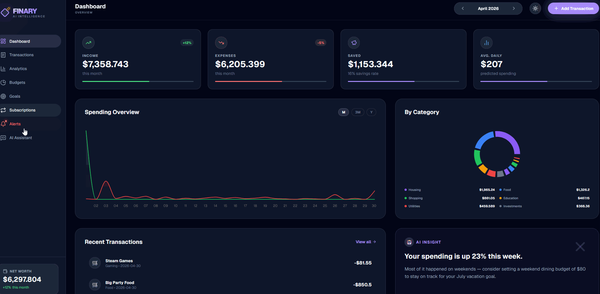
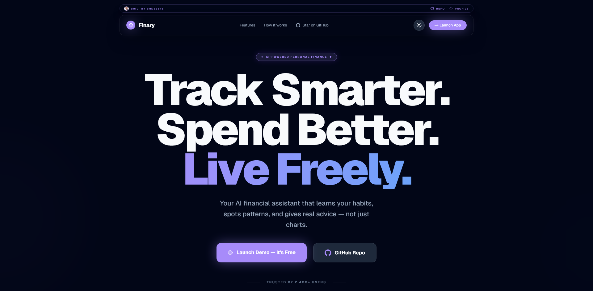
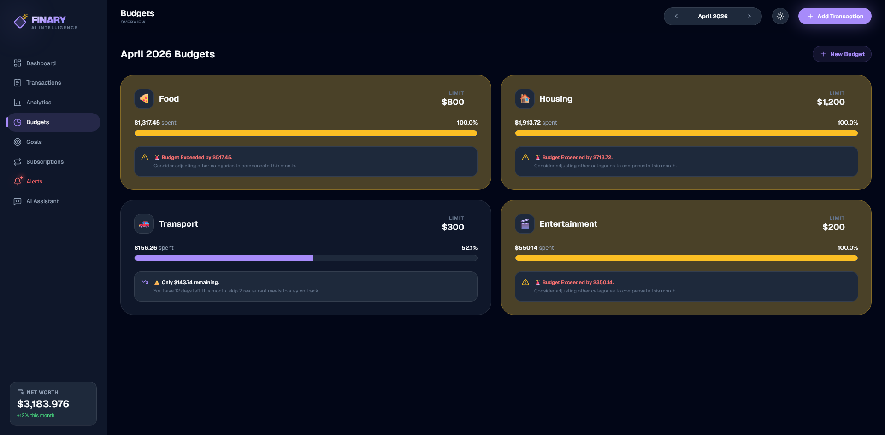

# ◆ Finary - AI Personal Finance Tracker

> Full-stack personal finance app built in **Next.js 14 + TypeScript + Tailwind CSS** that turns everyday transactions into clear insights — with an **AI assistant powered by Llama 3.1 via OpenRouter** that gives personalized recommendations based on real financial data.

<p align="center">
  
  
  
  
  
  
  
</p>

---

## 🔗 Live Demo

<p align="center">
  <a href="https://finary-app.netlify.app/">
    
  </a>
</p>

> No signup required · Works instantly with seeded demo data · Responsive on desktop and mobile

---

## 🎬 Preview

<!-- REPLACE: add demo GIF as docs/demo.gif -->


---

## 📸 Screenshots

<!-- REPLACE: add landing screenshot as docs/landing.png -->
### Landing Page


<!-- REPLACE: add main dashboard screenshot as docs/dashboard.png -->
### Dashboard Overview


<!-- REPLACE: add analytics screenshot as docs/analytics.png -->
### Analytics & Spending Patterns


<!-- REPLACE: add AI assistant screenshot as docs/ai-chat.png -->
### AI Financial Assistant


<!-- REPLACE: add budgets screenshot as docs/budgets.png -->
### Budgets & Alerts


<!-- REPLACE: add mobile screenshot as docs/mobile.png -->
### Mobile Experience


---

## 📌 Project Goal

Most personal finance tools fall into two extremes: they are either too basic to be useful, or too complex for everyday users. Finary is designed to sit in the middle — a modern **AI-enhanced finance tracker** that helps users understand spending habits, stay on budget, and make better financial decisions without needing a bank integration or account setup.

The app is designed as a **portfolio showcase** demonstrating:

- Full-stack **Next.js 14** architecture with App Router and API routes
- Real-world **AI integration** through OpenRouter and free Llama models
- Advanced **UI/UX design** with animations, polished dark theme, and responsive layouts
- Clean client-side persistence using **Zustand + localStorage**
- Strong product thinking: onboarding-free experience, instant demo data, and frictionless interaction

---

## 🧭 Application Structure

| # | Page | What it does |
|---|------|--------------|
| 1 | 📊 **Dashboard** | Shows high-level KPIs: income, expenses, savings, spending trends, category breakdown, AI quick insight, and recent transactions |
| 2 | 💳 **Transactions** | Lets users browse, search, filter, add, edit, and delete transactions, with CSV export support |
| 3 | 📈 **Analytics** | Displays deeper spending insights: heatmap, top merchants, category trends, and day-of-week behavior |
| 4 | 🎯 **Budgets** | Tracks category-level monthly budgets with animated progress bars, warnings, and overspending alerts |
| 5 | ✈️ **Goals** | Lets users set savings goals with deadlines and track progress over time |
| 6 | 🤖 **AI Assistant** | Provides chat-based financial insights using the user's real transaction, budget, and goal data |

All dashboard sections react to the **selected month**, allowing users to compare periods and inspect trends over time.

---

## 🤖 AI Layer

The AI assistant is powered by **OpenRouter** with a free Llama model and receives structured financial context on every request.

### Context sent to the model

```text
- Current month income
- Current month expenses
- Savings rate
- Top spending categories
- Recent transactions
- Active budgets and usage %
- Financial goals and progress
```

### Example prompts

- *Where am I overspending this month?*
- *How can I save an extra $200?*
- *Compare this month to last month*
- *Can I afford a weekend trip right now?*
- *Which category should I reduce first?*

This makes the AI feel like a real financial copilot instead of a generic chatbot.

---

## 🧮 Core Logic

**Savings Rate** = (Income − Expenses) / Income × 100

**Budget Usage** = Category Spend / Budget Limit × 100

**Monthly Goal Target** = (Target Amount − Current Amount) / Remaining Months

**Expense Trend** = (Current Month Expenses − Previous Month Expenses) / |Previous Month Expenses| × 100

The app uses local state and derived calculations to keep the UI fast and reactive without requiring a database.

---

## ✨ UX & Design Highlights

- Custom **dark fintech-style interface** with violet accent palette
- **Animated landing page** with particle background and premium hero section
- **Smooth transitions** powered by Framer Motion
- **Count-up KPI animations** on load
- **Typing effect** for AI responses
- **Skeleton loaders** for async sections
- **Responsive dashboard layout** with mobile-first adaptations
- **Budget warning states** that visually escalate as spending increases
- **Seed data** on first launch so the app looks complete immediately
- No login wall, no empty state problem, no friction before seeing value

---

## 📊 Key Features

- AI-powered financial assistant
- Real-time dashboard with interactive charts
- Monthly and category-based analytics
- Spending heatmap
- Budget tracking with warnings
- Goal tracking with progress calculations
- CSV export
- Fully responsive UI
- localStorage persistence
- Seeded demo data for instant onboarding

---

## 🚀 Quick Start

```bash
# 1. Clone the repository
git clone https://github.com/YOUR_USERNAME/finary.git
cd finary

# 2. Install dependencies
pnpm install

# 3. Create env file
cp .env.example .env.local
```

Add your OpenRouter key to `.env.local`:

```env
OPENROUTER_API_KEY=sk-or-your-key-here
```

Then run:

```bash
pnpm dev
```

The app will open at:

```text
http://localhost:3000
```

---

## 🗂️ Project Structure

```text
finary/
├── app/
│   ├── page.tsx                  # Landing page
│   ├── dashboard/
│   │   ├── layout.tsx            # Dashboard shell
│   │   ├── page.tsx              # Main dashboard
│   │   ├── transactions/page.tsx
│   │   ├── analytics/page.tsx
│   │   ├── budgets/page.tsx
│   │   ├── goals/page.tsx
│   │   └── ai/page.tsx
│   └── api/chat/route.ts         # OpenRouter AI proxy
├── components/
│   ├── landing/
│   ├── dashboard/
│   └── ui/
├── lib/
│   ├── store.ts
│   ├── seed.ts
│   ├── ai.ts
│   ├── calculations.ts
│   └── types.ts
├── hooks/
├── docs/                         # GIFs and screenshots for README
│   ├── demo.gif
│   ├── landing.png
│   ├── dashboard.png
│   ├── analytics.png
│   ├── ai-chat.png
│   ├── budgets.png
│   └── mobile.png
├── README.md
└── LICENSE
```

---

## 🛠️ Tech Stack

- **Next.js 14** — App Router, routing, API endpoints
- **TypeScript** — type safety and maintainability
- **Tailwind CSS v4** — styling system
- **Framer Motion** — animations and transitions
- **Recharts** — dashboard visualizations
- **Zustand** — lightweight state management
- **localStorage** — client-side persistence
- **OpenRouter** — AI inference layer
- **Llama 3.1 8B Instruct (free)** — conversational financial assistant
- **Lucide React** — icons

---

## 🎨 Product Highlights

- Built as a **real portfolio-grade SaaS-style frontend**
- Combines **dashboard UX**, **AI features**, and **product presentation**
- Designed to impress both **clients** and **recruiters**
- Structured to be easily extendable with authentication, database, and recurring transactions in the future

---

## 🗺️ Roadmap

- [ ] Multi-currency support
- [ ] Recurring transactions
- [ ] Subscription detection
- [ ] CSV / bank import
- [ ] PDF monthly summary
- [ ] PWA support
- [ ] User authentication
- [ ] Cloud sync

---

## 🧑‍💻 Author

**Portfolio Project** · built as a demonstration of full-stack web development, AI integration, and modern product UI engineering.

> Built with ❤️ using Next.js, Tailwind CSS, and OpenRouter

---

## 📄 License

MIT — see [`LICENSE`](./LICENSE).
