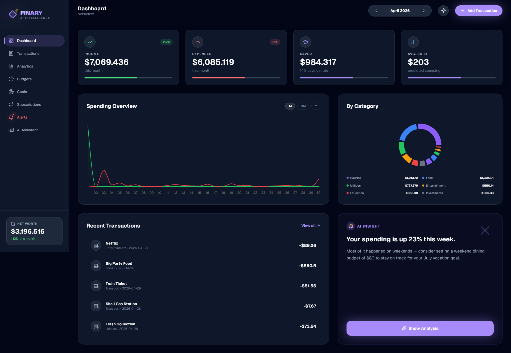
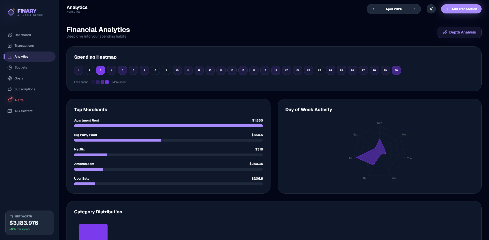
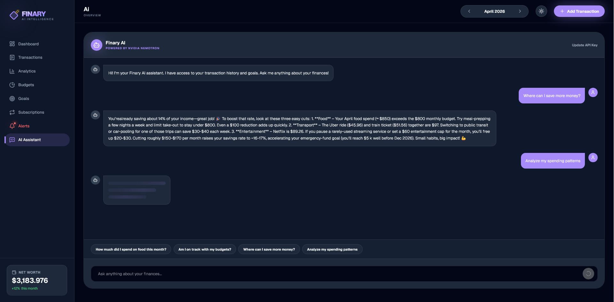
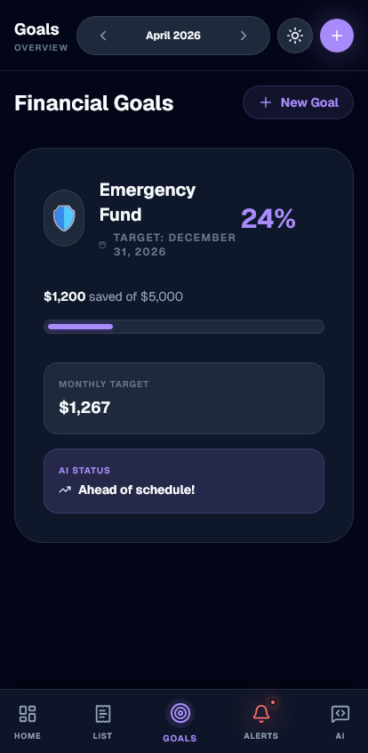

# Finary — AI Personal Finance Tracker

AI-powered finance tracker built with Next.js, Zustand and OpenRouter.
Track expenses, visualize spending patterns, set budgets and chat with your personal AI financial assistant.

## Features
- 📊 **Interactive Dashboards**: Deep insights with Recharts.
- 🤖 **AI Assistant**: Powered by Llama 3.1 via OpenRouter proxy.
- 🎯 **Budget & Goals**: Smart tracking with visual warnings.
- 📅 **Analytics**: Spending heatmap and day-of-week analysis.
- 💾 **100% Private**: Data stays in your browser (localStorage).
- 📱 **Mobile Optimized**: Fully responsive with bottom tab bar.

## Previews

<div align="center">
  
  
  <br />
  
  
</div>

## Tech Stack
- **Framework**: Next.js 16 (App Router)
- **State**: Zustand + Persist
- **Styling**: Tailwind CSS v4
- **Animations**: Framer Motion
- **Charts**: Recharts
- **AI**: OpenRouter API

## Getting Started

1. Clone the repo
2. Install dependencies:
   ```bash
   pnpm install
   ```
3. Set your OpenRouter API Key in `.env.local`:
   ```
   OPENROUTER_API_KEY=your_key_here
   ```
4. Run the development server:
   ```bash
   pnpm dev
   ```

## Design System
- **Background**: #0a0a0a
- **Accent**: #7c3aed (Violet)
- **Fonts**: Cabinet Grotesk & Satoshi (via Geist/Geist Mono placeholders)
